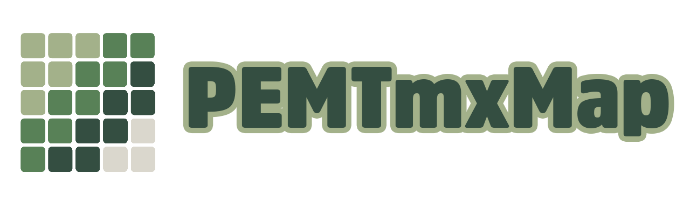

<a href="https://github.com/p-edge-media/PEMTmxMap">

**PEMTmxMap** creates `SpriteKit` game maps from TMX Map files. [TMX Map files][tmx-map-url] can be created and edited with [Tiled][tiled-url].

Based on the well-known [JSTileMap][jstilemap-url] project which was famously used in Ray Wenderlichs [SuperKoalio][superkoalio-url] tutorial but no longer seems to be maintained. I hope to make a light-weight framework that supports iOS, macOS and tvOS.

This project also contains a Demo game based on SuperKoalio to show an example of how to use the TMX Tile Map in a SpriteKit game.

## TMX Features

- [X] read and parse TMX map files
- [X] CSV, Base64 layer formats with gzip, zlib or no compression
- [ ] Zstandard compression 
- [X] fixed size maps
- [ ] infinite maps
- [X] orthogonal map types
- [ ] isometric map types
- [ ] isometric staggerd map types
- [ ] hexagonal staggered map types
- [X] map background color
- [X] embedded tile sets
- [X] tilesets based on a tileset image
- [X] tilesets based on a collection of images
- [ ] external TSX tile sets
- [ ] terraintypes and wangsets
- [ ] object groups
- [ ] object template files
- [ ] image layers
- [ ] grouped layers
- [X] layer tinting
- [X] flipped tiles
- [ ] animated tiles
- [ ] properties

## PEMTmxMap Features

- [X] Swift 5
- [ ] Objective-C compatibility
- [X] iOS (>13.6), macOS (>10.15), tvOS (>13.4)
- [ ] watchOS support
- [X] generates the TMX map as an `SKNode` with child elements as `SKNode` subclasses (eg. a tile as a `SKSpriteNode` etc.)
- [X] supports both nearest neighbor and linear texture antialiasing
- [ ] access layers, tiles, objects
- [ ] camera tilt and zoom
- [ ] anti-tearing (removing tear lines between tiles)
- [ ] scroll using the TMX parallax properties
- [ ] Touch, Mouse, Keyboard control

## Demo Game Features
- [ ] load map
- [ ] spawn player on the map
- [ ] level completed, load next map
- [ ] game over
- [ ] sound & music with Audio Unit effects
- [ ] input: touch screen control
- [ ] input: keyboard and mouse
- [ ] input: Apple TV remote controller
- [ ] input: external game controllers

[tmx-map-url]:https://doc.mapeditor.org/en/stable/reference/tmx-map-format/#
[tiled-url]:http://www.mapeditor.org
[jstilemap-url]:https://github.com/slycrel/JSTileMap
[superkoalio-url]:https://www.raywenderlich.com/2891-how-to-make-a-platform-game-like-super-mario-brothers-part-1
