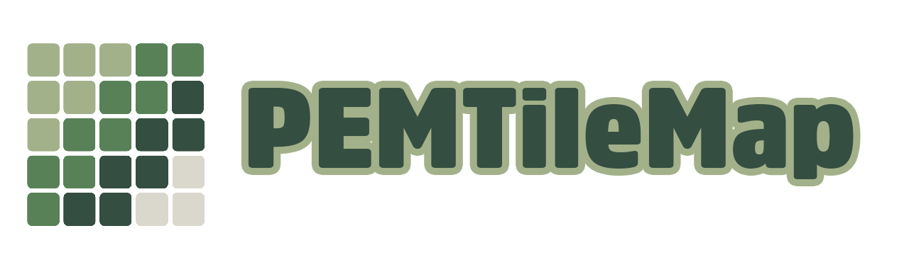

<a href="https://github.com/p-edge-media/PEMTileMap">

  
**PEMTileMap** creates `SpriteKit` game maps from TMX Map files. [TMX Map files][tmx-map-url] can be created and edited with [Tiled][tiled-url].

Based on the well-known [JSTileMap][jstilemap-url] project which was famously used in Ray Wenderlichs SpriteKit [SuperKoalio][superkoalio-url] tutorial but no longer seems to be maintained. I hope to make a light-weight framework that supports iOS, macOS and tvOS.
  

I also made a [Swift 5 version of the SuperKoalio game][superkoalio-project-url], which uses `PEMTileMap` to generate the map and also supports iOS, macOS and tvOS.
  
‼️ *This project is IN DEVELOPMENT. The master branch will be pushed when the code is alpha ready.* ‼️

## TMX Features
- [X] read and parse TMX map files
- [X] CSV, Base64 layer formats with gzip, zlib or no compression
- [X] fixed size maps
- [X] orthogonal map types
- [X] isometric map types
- [X] map background color
- [X] embedded tile sets
- [X] tilesets based on a tileset image
- [X] tilesets based on a collection of images
- [X] tilesets using a specific color for transparency
- [X] external TSX tile sets
- [X] object groups
- [X] object template files
- [X] image layers
- [X] layer groups
- [X] layer tinting
- [X] flipped tiles
- [X] animated tiles
- [X] properties
  
## Not (yet) supported
- [ ] Zstandard compression 
- [ ] world files
- [ ] infinite maps
- [ ] isometric staggered map types
- [ ] hexagonal staggered map types
- [ ] terraintypes, wangsets, transformations
- [ ] image `<trans>` color

## Known issues
Please refer to the [issue tracker][issues-url] on GitHub. All bugs reports, feature requests and comments are welcome.

## PEMTileMap Features
- [X] Swift 5
- [ ] Objective-C compatibility
- [X] iOS (>13.6), macOS (>10.15), tvOS (>13.4)
- [X] generate TMX maps as `SKNode` objects with child elements as `SKNode` subclasses (eg. a tile as a `SKSpriteNode`, a polygon object as an `SKShapeNode`, etc.)
- [X] both nearest neighbor and linear texture antialiasing
- [X] camera tilt and zoom
- [ ] access layers, tiles, objects
- [ ] parallax scroll
- [ ] anti-tearing (removing tear lines between tiles)
  
## License
Licensed under the [MIT license](license.md).

[issues-url]:https://github.com/hotdogsoup-nl/PEMTileMap/issues
[tmx-map-url]:https://doc.mapeditor.org/en/stable/reference/tmx-map-format/#
[tiled-url]:http://www.mapeditor.org
[jstilemap-url]:https://github.com/slycrel/JSTileMap
[superkoalio-project-url]:https://github.com/hotdogsoup-nl/PEMSuperKoalio
[superkoalio-url]:https://www.raywenderlich.com/2554-sprite-kit-tutorial-how-to-make-a-platform-game-like-super-mario-brothers-part-1
